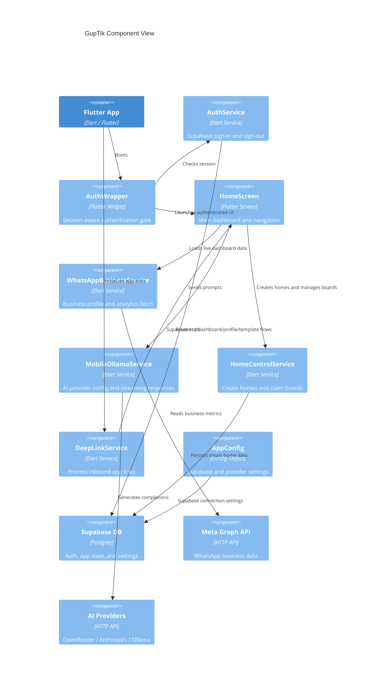

# GupTik C4-Style Architecture

## Context Diagram

```mermaid
C4Context
    title GupTik System Context
    Person(user, "User", "Business owner / home user")
    System(app, "GupTik Mobile App", "Flutter application for dashboard, AI, smart home, and messaging")

    System_Boundary(ext, "External Systems") {
        SystemDb("Supabase", "Authentication and persistence")
        SystemMeta("Meta / WhatsApp Graph API", "Business profile and analytics")
        SystemAi("AI Providers", "OpenRouter / Ollama / Anthropic")
        SystemLinks("Deep Link / Webhook Layer", "App links and webhook callbacks")
    }

    Rel(user, app, "Uses")
    Rel(app, SystemDb, "Auth, sessions, user data")
    Rel(app, SystemMeta, "WhatsApp business analytics")
    Rel(app, SystemAi, "Chat completion requests")
    Rel(SystemLinks, app, "Launches deep links and routes")
    Rel(SystemDb, app, "Returns live app data")
```

## Container Diagram

```mermaid
C4Container
    title GupTik Container View
    Person(user, "User")

    Container_Boundary(mobile, "Mobile Client") {
        Container(app, "Flutter App", "Dart / Flutter", "UI entrypoint and app shell")
        Container(auth, "Auth Wrapper", "Flutter widget", "Checks Supabase session and redirects")
        Container(home, "Home Dashboard", "Flutter screen", "Main dashboard and feature navigation")
        Container(ai, "AI Module", "Flutter screen + service", "LLM assistant and history")
        Container(sh, "Smart Home Module", "Flutter screens + provider", "Boards, rooms, switches, wallapers")
        Container(wa, "WhatsApp Module", "Service + screens", "Business analytics and messaging")
        Container(profile, "Profile / Deep Link Module", "Routes + service", "Profile settings and app links")
    }

    System_Boundary(ext, "External Services") {
        ContainerDb("Supabase", "Database + Auth", "Postgres + Auth")
        ContainerMeta("Meta Graph API", "WhatsApp Business APIs", "HTTP API")
        ContainerAi("AI Providers", "LLM endpoints", "OpenRouter / Anthropic / Ollama")
    }

    Rel(user, app, "Uses")
    Rel(app, auth, "Loads")
    Rel(auth, home, "Redirects to authenticated home")
    Rel(home, wa, "Navigates to WhatsApp features")
    Rel(home, ai, "Opens AI assistant")
    Rel(home, sh, "Opens smart-home control")
    Rel(home, profile, "Accesses profile and deep-link flows")

    Rel(app, ContainerDb, "Supabase auth, tables, settings")
    Rel(app, ContainerMeta, "Fetch WhatsApp metrics")
    Rel(app, ContainerAi, "Send prompts, receive responses")
    Rel(profile, ContainerDb, "Save user settings and config")
```

## Component Diagram



## System Summary

- Authentication is handled by Supabase through the `AuthService` and `AuthWrapper`.
- The app uses a dashboard-first navigation model from `HomeScreen`.
- Feature modules include WhatsApp analytics, smart home, AI assistant, vault, and profile configuration.
- External dependencies include Supabase, Meta WhatsApp APIs, and LLM provider endpoints.
- Deep linking and webhooks route users to specific screens or auth flows.
